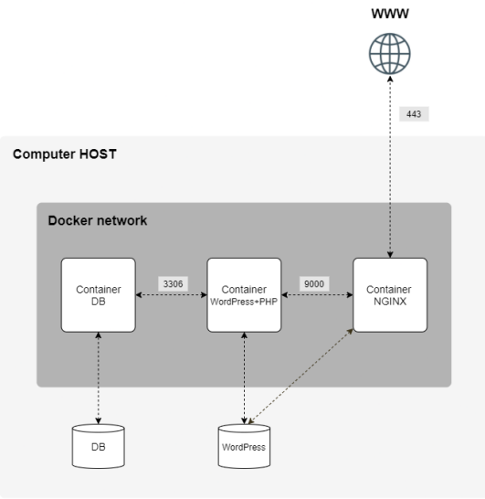

# Inception
> Setting up infrastructure with Docker containers.
## Overview
This project is about setting up a small webserver infrastructure composed of different services under specific rules. Docker containers are used to handle the services, all built through the usage of docker-compose.

# Description

## Features

- **Nginx Reverse Proxy**: An Nginx server is configured to act as a reverse proxy, routing requests to the appropriate service based on the URL.
- **Wordpress Service**: Serves a website
- **Database Service**: Stores data for the WordPress site.
- **SSL/TLS Encryption**: The Nginx server is set up with (self signed) SSL/TLS certificates to secure the communication between clients and the server.

## Dependencies

- Linux or macOS environment
- Docker

## Build and run the project

1. Clone the repository and navigate to the project directory.

2. Set up the environment variables by creating a `.env` file in the project root directory. You can use the provided `.env.example` file as a template.

2. Run the following command to build and start the services:

        make

3. Access the WordPress site by navigating to `https://localhost` in your web browser. You may need to accept the self-signed certificate warning.

4. As the database is protected behind the nginx reverse proxy, you can access it by navigating to `https://localhost/phpmyadmin` in your web browser. Use the credentials specified in the docker-compose.yml file to log in.
