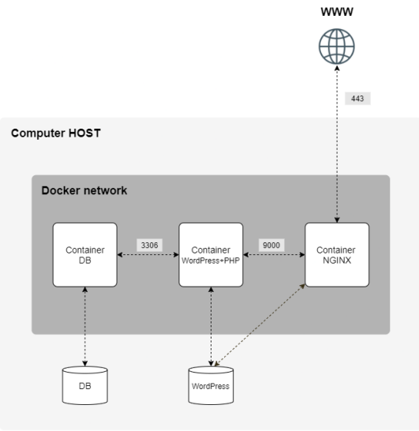

# Inception
> Setting up infrastructure with Docker containers.
## Overview
This project is about setting up a small webserver infrastructure composed of different services under specific rules. Docker containers are used to handle the services, all built through the usage of docker-compose.

# Description

## Features

- **Nginx Reverse Proxy**: An Nginx server is configured to act as a reverse proxy, routing requests to the appropriate service based on the URL.
- **Wordpress Service**: Serves a website
- **Database Service**: Stores data for the WordPress site.
- **SSL/TLS Encryption**: The Nginx server is set up with (self signed) SSL/TLS certificates to secure the communication between clients and the server.

## Dependencies

- Linux or macOS environment
- Docker

## Build and run the project

1. Clone the repository and navigate to the project directory.

2. Set up the secrets and credentials for the project by adapting the files in `srcs/secrets` to your needs. Rename them to `filename.txt` (e.g., `db_password.template` to `db_password.txt`). By default, the project is set up to not push any .txt files in this directory to the repository, so you can safely store your credentials there.

2. Run the following command to build and start the services:

        make

3. Access the WordPress site by navigating to `https://localhost` in your web browser. You may need to accept the self-signed certificate warning.

4. As the database is protected behind the nginx reverse proxy, you can only access it through the Docker container. To access the database, you can use the following command:

        docker exec -it mariadb mysql -u root -p

## Cleanup

1. To stop the services, run the following command:

        make down

2. To delete the Docker containers, run the following command:

        make clean

3. To delete the Docker containers and remove all associated data, run the following command:

        make fclean

4. To remove the build cache in Docker, run the following command:

        make nuke